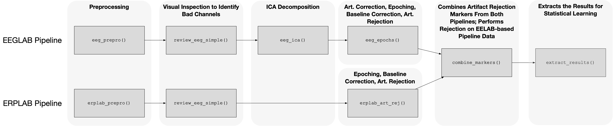
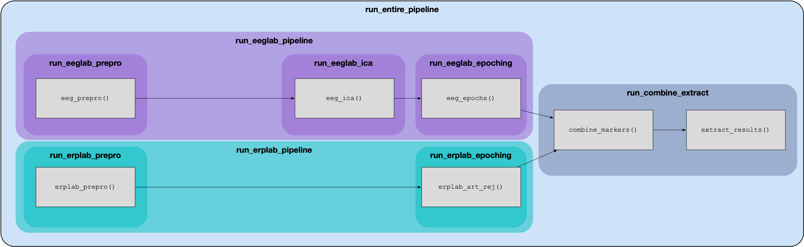

# Summer EEG Processing Pipeline

A MATLAB-based EEG preprocessing pipeline for ERP (event-related potential) analysis. This pipeline takes raw BioSemi `.bdf` recordings and processes them through filtering, ICA artifact removal, epoching, and artifact rejection to produce analysis-ready datasets.

The pipeline runs two parallel processing streams — one using EEGLAB and one using ERPLAB — then merges their artifact rejection decisions to maximize data quality.

## Prerequisites

- **MATLAB** (R2020b or later recommended)
- **EEGLAB** toolbox ([download](https://sccn.ucsd.edu/eeglab/download.php)) with these plugins:
  - **ERPLAB** — ERP-specific processing and artifact detection
  - **ICLabel** — automatic ICA component classification
  - **CleanLine** — 60 Hz line noise removal
  - **BIOSIG** — reading BioSemi `.bdf` files
- Basic familiarity with MATLAB and the command window

### Installing EEGLAB plugins

Open EEGLAB in MATLAB, go to **File > Manage EEGLAB extensions**, and install ERPLAB, ICLabel, CleanLine, and BIOSIG from the list.

## Getting Started

### 1. Clone the repository

```bash
git clone <repo-url> summer-eeg
cd summer-eeg
```

### 2. Add your data files

Place raw `.bdf` files in the `data/` directory. See [`data/README.md`](data/README.md) for naming conventions.

### 3. Set up the subject list

Edit `doc/ss-info.xlsx`:
- **Column 1**: Subject IDs (must match `.bdf` filenames without extension, e.g., `CS_05_16_1`)
- **Column 2**: Bad channel indices (comma-separated integers, or empty if none)

Note that the first sheet is for batch processing. 
Feel free to use the other sheets for tracking participant progress through pipeline steps, taking notes, etc.

### 4. Run setup in MATLAB

```matlab
cd('/path/to/summer-eeg')
setup
```

This adds all paths, initializes EEGLAB, and creates output directories.

## Running the Pipeline

After running `setup`, execute each step from the MATLAB command window. Steps 1-6 have batch scripts that process all subjects automatically. Steps 7-8 are run per-subject for now.

### Step 1: EEGLAB Preprocessing

```matlab
run_eeglab_prepro
```

Loads raw `.bdf` files, removes external channels (EXG1-8), re-references to average mastoids, resamples to 256 Hz, applies 60 Hz CleanLine removal, and saves two filtered versions:
- **0.1 Hz highpass** — used for epoching (preserves slow ERPs)
- **1 Hz highpass** — used for ICA (improves decomposition quality)

Output: `output/01_preprocessed/`

### Step 2: ICA Decomposition

```matlab
run_eeglab_ica
```

Removes bad channels (from `ss-info.xlsx`), runs ICA on the 1 Hz filtered data, and saves only the weight matrices as lightweight `.mat` files (~1-5 MB instead of 100+ MB full datasets).

Output: `output/02_ica/`

### Step 3: EEGLAB Epoching and Artifact Rejection

```matlab
run_eeglab_epoching
```

Loads the 0.1 Hz preprocessed data, removes bad channels, applies ICA weights, rejects eye/muscle components using ICLabel, interpolates bad channels back to restore the full 64-channel montage, epochs around stimulus events, removes baseline, and rejects epochs exceeding the amplitude threshold (100 uV).

Output: `output/04_epoched/` and `output/05_artifacts_rejected/`

### Step 4: ERPLAB Preprocessing

```matlab
run_erplab_prepro
```

Independent preprocessing using ERPLAB: bandpass filtering (0.01-30 Hz), re-referencing, resampling, epoching, and baseline correction.

Output: `output/01_preprocessed/` (with `-erplab` suffix)

### Step 5: ERPLAB Artifact Rejection

```matlab
run_erplab_epoching
```

Applies ERPLAB's 5-step artifact detection:
1. Extreme values (> 100 uV)
2. Peak-to-peak in moving windows (> 75 uV)
3. Step-like artifacts (> 60 uV, catches blinks/saccades)
4. Linear trends (drift detection)
5. Flatline detection

Epochs failing any test are physically removed.

Output: `output/04_epoched/` and `output/05_artifacts_rejected/` (with `-erplab` suffix)

### Step 6: Combine Markers and Extract Results

```matlab
run_combine_extract
```

For each subject, merges EEGLAB and ERPLAB rejection decisions with logical OR (an epoch rejected by *either* pipeline is removed), saves the final clean dataset, then exports analysis-ready data as a `.mat` file containing the 3D data matrix (channels x time x trials), time vector, channel labels, stimulus triggers, and original trial numbers.

Output: `output/06_final/` (`.set` and `.mat` files)

### Running Full Pipelines

Instead of running each step individually, you can use meta-pipeline scripts that chain the steps together:

```matlab
% Run the full EEGLAB pipeline (Steps 1-3)
run_eeglab_pipeline

% Run the full ERPLAB pipeline (Steps 4-5)
run_erplab_pipeline

% Run everything end-to-end (Steps 1-6)
run_entire_pipeline
```

These are the recommended way to run the pipeline from scratch.

## Processing Flow



```
Raw .bdf data
    |
    +---> EEGLAB Pipeline                    ERPLAB Pipeline <---+
    |     1. run_eeglab_prepro               4. run_erplab_prepro
    |        (0.1 Hz + 1 Hz filtered)           (bandpass filtered)
    |     2. run_eeglab_ica                  5. run_erplab_epoching
    |        (ICA weights on 1 Hz data)         (5-step artifact detection)
    |     3. run_eeglab_epoching                 |
    |        (ICA cleanup + epoch + reject)      |
    |        |                                   |
    |        +--- epoched data ---+--- epoched data ---+
    |                             |
    |                   6. run_combine_extract
    |                      (merge markers + export)
    |                             |
    v                       Final .mat files
```

### Meta-Pipeline Scripts

Rather than running each step individually, three meta-pipeline scripts chain the stages together automatically. `run_eeglab_pipeline` runs the EEGLAB side (Steps 1-3: preprocessing, ICA, and epoching). `run_erplab_pipeline` runs the ERPLAB side (Steps 4-5: preprocessing and artifact rejection). Because the EEGLAB and ERPLAB pipelines are independent, they can be run in either order. Once both have completed, `run_entire_pipeline` can be used to run all six steps end-to-end in a single call — it executes the EEGLAB pipeline, then the ERPLAB pipeline, then the final combine-and-extract step.



## Reviewing Data

Use `review_eeg_simple` to visually inspect data at any processing stage:

```matlab
config = default_config();

% Review EEGLAB-processed data
EEG = review_eeg_simple('CS_05_16_1', 'preprocessed', config);
EEG = review_eeg_simple('CS_05_16_1', 'ica', config);
EEG = review_eeg_simple('CS_05_16_1', 'epoched', config);

% Review ERPLAB-processed data
EEG = review_eeg_simple('CS_05_16_1', 'artifacts_rejected', config, 'erplab');
```

Available stages: `raw`, `preprocessed`, `preprocessed_1hz`, `ica`, `components_rejected`, `epoched`, `artifacts_rejected`, `final`

## Directory Structure

```
summer-eeg/
├── data/               Raw .bdf files and marker version files
├── doc/                Subject list, channel locations, reference papers
├── output/             All processing output (auto-created by setup)
│   ├── 01_preprocessed/
│   ├── 02_ica/
│   ├── 03_components_rejected/
│   ├── 04_epoched/
│   ├── 05_artifacts_rejected/
│   ├── 06_final/
│   └── logs/           Per-subject processing logs
├── pipeline/           Batch processing and meta-pipeline scripts (run_*.m)
├── src/
│   ├── default_config.m   Central configuration
│   ├── functions/         Core processing functions
│   └── utils/             Helper utilities
├── setup.m             Run this first in MATLAB
└── README.md           This file
```

See the README in each directory for more detail.

## Configuration

All processing parameters are centralized in [`src/default_config.m`](src/default_config.m). Key settings you might want to adjust:

| Parameter | Default | Description |
|-----------|---------|-------------|
| `sampling_rate` | 256 Hz | Target sampling rate after resampling |
| `highpass_01hz` | 0.1 Hz | Highpass filter for epoching |
| `highpass_1hz` | 1 Hz | Highpass filter for ICA |
| `epoch_window` | [-0.2, 1.0] s | Epoch time window around events |
| `baseline_window` | [-0.2, 0] s | Baseline correction window |
| `amplitude_threshold` | 100 uV | EEGLAB artifact rejection threshold |
| `event_codes` | {'11', '22'} | Stimulus event codes to epoch on |
| `reference_channels` | [24, 61] | Average mastoid reference channels |

ERPLAB artifact rejection thresholds are in `config.erplab_art_rej.*`. ICLabel component rejection thresholds are in `config.ica_rejection.*`.

## Troubleshooting

**"setup.m must be run from the project root directory"**
Make sure your MATLAB current directory is the `summer-eeg/` folder before running `setup`.

**"Undefined function 'eeglab'"**
EEGLAB is not on the MATLAB path. Add it manually: `addpath('/path/to/eeglab'); eeglab;` then run `setup` again.

**"Undefined function 'pop_biosig'" or BIOSIG errors**
The BIOSIG plugin is not installed. Open EEGLAB > File > Manage EEGLAB extensions and install it.

**"Undefined function 'pop_creabasiceventlist'" or ERPLAB errors**
The ERPLAB plugin is not installed or the version doesn't match. Check `config.erplab_dir` in `default_config.m` — you may need to update the ERPLAB folder name to match your installed version.

**ICA weight dimension mismatch**
If you change which channels are marked as bad in `ss-info.xlsx`, you need to re-run the pipeline from `run_eeglab_ica` onward. ICA weights are specific to the number of channels used during decomposition.

**CleanLine not found**
Install the CleanLine plugin via EEGLAB's extension manager.
